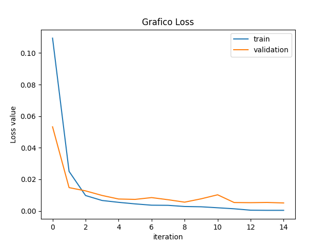
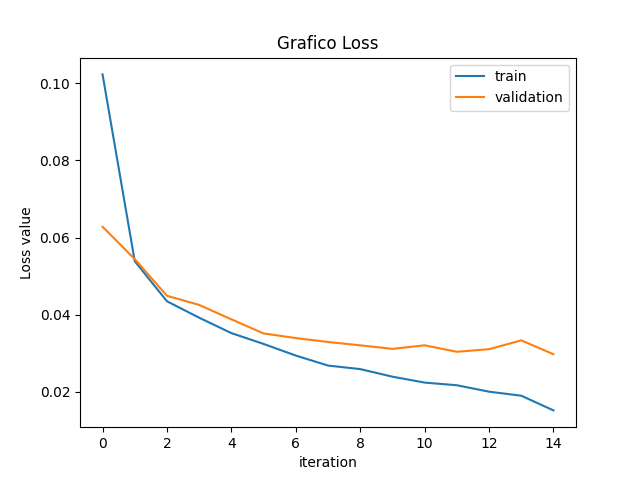
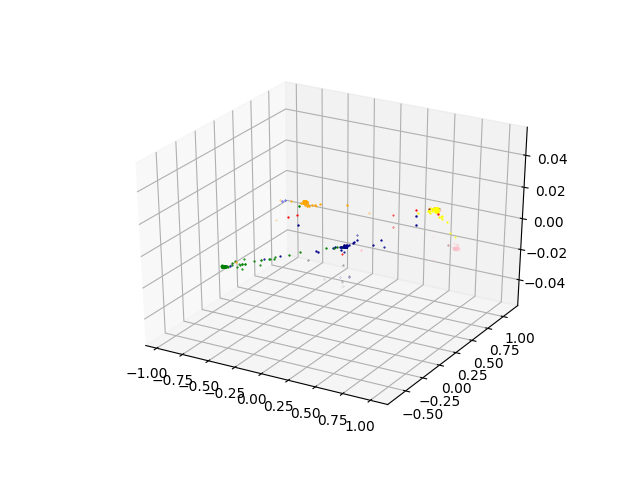
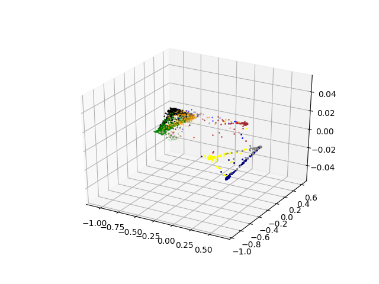

A Simple implementation of the method described in the article: "Dimensionality Reduction by Learning an Invariant Mapping"

The deep learning framework Pytorch was utilized, and tests was made using the MNIST and FashionMNIST datasets.

Following are the plots of the loss during training and validation of each dataset, and the plots of the resulting embedding representation, 3 dimensional embedding was choosen for visualization purpose.

Mnist

FashionMnist

Mnist

FashionMNIST

